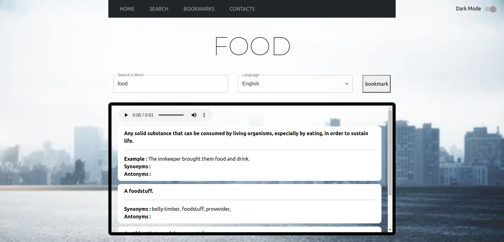

# Dictionary Application
An application used to search for words from a dictionary and get the words meanings an synonyms.

This project was bootstrapped with [Create React App](https://github.com/facebook/create-react-app).

## Project Status
This project is currently under development.

### Project Screen Shot (UI)

### Installation ansd Setup Instructions

Clone down this repository. You will need `node` and `npm` installed globally on your machine.  

Installation:

`npm install`  

To Run Test Suite:  

`npm test`  

To Start Server:

`npm start`  

To Visit App:

## Known Bugs
There are no known bugs as of now.

## Technologies Used
* HTML- to build the structure of the page
* CSS- to style the the pages
* Reactjs Library- to create the app
* Materialui
* Bootstrap

### Reflection 
This was a 1 week long project built during my second module at Moringa School of Software Development. Project goals included using technologies learned up until this point and familiarizing myself with documentation for new features.

Originally I wanted to build an application that allowed users to search for various words form the dictionary API and get the meanings back.  I started this process by using the `create-react-app` boilerplate, then adding `Materialui` and `bootstrap`.

## Support and contact details
Contact me via gracenyangayi@gmail.com
